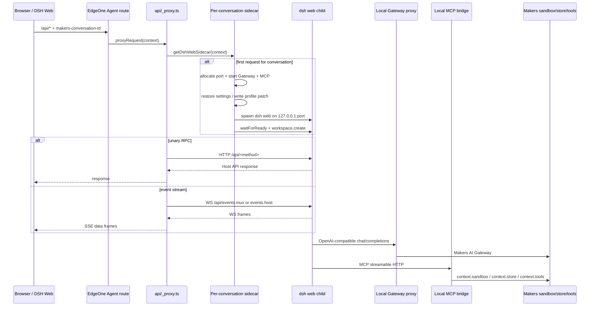

# A02 — Runtime architecture / sidecar / Host API

## 1. Metadata
- Repository: `thanhhaixn92/PQG-Harness`
- Base branch: `main`
- Exact base SHA: `70119cfdae992a203a5e29eb24e91c7200222a7c`
- Audit date/time: `2026-09-04T16:53:00+07:00` (ICT)
- Auditor/subagent: OpenAI GPT-5.6 Sol — Audit A02
- Verdict: **PARTIAL**

**Severity count:** P0 = 0, P1 = 4, P2 = 4, P3 = 0.

The verdict is `PARTIAL`, rather than `PASS WITH RISKS`, because several lifecycle/concurrency defects are directly visible in the source while production semantics that determine their exact frequency and blast radius (EdgeOne request-context lifetime, browser-disconnect propagation, worker recycling, and live port reuse) were not reproducible from this audit runtime. No runtime/source files were changed.

## 2. Scope

This audit is limited to the runtime architecture that connects DSH Web in the browser to the EdgeOne Makers Agent runtime and the per-conversation DSH sidecar:

- Browser/DSH Web → generated EdgeOne Agent route → `agents/api/_proxy.ts`.
- Per-conversation sidecar creation, caching, readiness, lifecycle, idle cleanup, and termination in `agents/_dsh-web-sidecar.ts`.
- DSH Host RPC forwarding and WebSocket → SSE adaptation.
- Local AI Gateway adapter and MCP bridge lifecycle.
- `POST /stop` cancellation interaction between the DSH child and `context.utils.abortActiveRun()`.
- Settings restore/snapshot behavior.
- Boundary between process-local `/tmp`, Makers persistent/store state, and Makers sandbox workspace state.
- Build-time static Host API route generation and assumptions about the EdgeOne route scanner.

Explicitly out of scope except for cross-audit handoff: authentication/authorization and conversation-ID trust (A03), detailed workspace isolation/persistence (A04), MCP permission policy (A06), EdgeOne quotas/deployment limits (A07), dependency/upstream compatibility (A08), full test/CI quality (A09), and production black-box smoke testing (A12).

## 3. Method

1. Re-verified `main` immediately before creating the audit branch and pinned all inspection to exact SHA `70119cfdae992a203a5e29eb24e91c7200222a7c`.
2. Enumerated the repository tree at the pinned commit and traced the runtime call graph by symbol/function rather than by branch-head state.
3. Read the key sidecar, proxy, gateway, MCP, workspace, stop, generator, prepared frontend, configuration, and relevant test files at the exact base SHA.
4. Traced state ownership and lifecycle across browser storage, Agent invocation context, process memory, `/tmp`, `context.store`, and `context.sandbox`.
5. Performed concurrency/failure-path reasoning for start, ready, request, stream, idle sweep, stop, child exit, and settings persistence paths.
6. Inspected existing tests and the exact commit's GitHub status/workflow metadata. The exact commit had no reported commit statuses and no associated GitHub Actions workflow runs.
7. No implementation was changed. No production destructive testing was performed.

**Execution limitation:** a local repository clone/test execution was attempted from the audit runtime but external DNS/network access to `github.com` was unavailable. Therefore this report distinguishes source-confirmed findings from live/runtime behavior that remains `NOT VERIFIED`. Production smoke and concurrency reproduction should be performed under A12/A09 rather than being implied here.

## 4. Architecture / current-state summary

### 4.1 Request and stream path

The browser boot code creates a sticky UUID in `localStorage` (`dsh-makers-web-conversation-id`) and wraps same-origin `fetch` calls whose path begins with `/api` or `/rpc`, adding the `makers-conversation-id` header. The prepared DSH connection bundle uses streaming `fetch`/SSE for `events.mux` and `events.host`, rather than browser WebSocket directly.

Generated route files under `agents/api/` are concrete Agent entrypoints. Each route delegates to `agents/api/_proxy.ts`. Unary RPC is forwarded to a loopback `dsh web` child. Event routes instead open a loopback WebSocket to the DSH Host and expose an SSE `ReadableStream` to the browser.

### 4.2 Sidecar ownership and lifecycle

`sidecars` is a process-local `Map<string, Promise<DshWebSidecar>>`, keyed only by conversation ID. Storing the in-flight `Promise` correctly deduplicates concurrent first-start requests within one JS process.

Startup performs the following sequence:

1. `freePort()` binds an ephemeral loopback port, reads the port number, then closes that listener.
2. In parallel, local Gateway and MCP HTTP servers are started on their own ephemeral loopback ports.
3. `$DSH_HOME` is derived as `/tmp/dsh-makers-web/<safe-conversation-id>`.
4. Settings YAML is restored from conversation metadata when available; Makers profile/config files are written to the local home.
5. The DSH child is spawned as `node ... dsh web --host 127.0.0.1 --port <port>` with `HOME=/tmp`, `DSH_HOME=<home>`, and `DSH_CWD=<home>`.
6. `waitForReady()` polls `GET /` for up to 45 seconds while checking child exit.
7. The local DSH workspace directory is created and `workspace.create` is sent through Host API.

The sidecar is considered idle after 25 minutes according to `lastUsedAt`. Idle sweeping is demand-driven: `sweepIdleSidecars()` runs only when another `getDshWebSidecar()` occurs.

### 4.3 State boundaries

| State | Current owner/location | Durability visible from repository |
|---|---|---|
| Browser conversation key | Browser `localStorage` | Browser-local; persists until storage is cleared |
| Sidecar registry | JS process `Map` | Process-local only |
| DSH home/config | `/tmp/dsh-makers-web/<conversation>` | Ephemeral process/container filesystem |
| `settings.yaml` | DSH home plus `conversation.metadata.dshSettingsYaml` | Explicit store snapshot/restore exists, bounded to 256 KiB |
| Local DSH Host workspace registration | `/tmp/.../workspace` | Ephemeral Host-side path |
| Coding workspace used by Makers MCP tools | `context.sandbox`, path `projects/<conversation>/workspace` | Platform sandbox state; `_workspace.ts` also maintains a bounded metadata fallback snapshot |
| Workspace fallback snapshot | `conversation.metadata.workspaceSnapshot` | Up to 80 files / 2 MiB, based on wrapper code |
| Gateway/MCP loopback servers | JS process / loopback sockets | Process-local only |
| DSH session/history/log state beyond settings | Upstream DSH internals under the spawned Host | **NOT VERIFIED** for durability across worker/container replacement; this repository does not explicitly snapshot that state |

The architecture intentionally separates the DSH Host's local `/tmp` workspace registration from actual file/command/preview operations, which are routed through Makers MCP to `context.sandbox`. This separation should be preserved, but its invariants depend on the MCP permission/profile layer (handoff A06).

### 4.4 Mandatory A02 questions — direct answers

| Question | Answer |
|---|---|
| 1. Does free-port allocation have a race? | **Yes. CONFIRMED.** The listening socket is closed before the child binds, creating a TOCTOU window. See A02-P1-01. |
| 2. Can the sidecar map/promise leak or become stale? | **Yes. CONFIRMED.** Idle sweep runs before current-use refresh, long-lived SSE does not refresh activity, cleanup is demand-driven, and some failure/exit paths do not close all companion resources. See A02-P1-02 and A02-P2-01. |
| 3. Can context updates become stale/cross-request? | **Yes, there is a confirmed context-lifetime split.** `sidecar.context` is replaced on later requests, but Gateway/MCP closures retain the creation context. Whether EdgeOne makes those context objects fully interchangeable is NOT VERIFIED. See A02-P1-03. |
| 4. Is SSE cancellation/error/close handling complete? | **Partially.** Normal abort/error/close handlers exist and the frontend reconnects, but cancellation while waiting for sidecar startup can race listener installation; production disconnect propagation/idle timeout semantics are NOT VERIFIED. See A02-P2-02. |
| 5. Can settings restore/snapshot fail silently? | **Yes. CONFIRMED.** Restore catches all errors and returns false; write-response persistence ignores a false snapshot result. See A02-P2-03. |
| 6. Do generated routes rely on scanner/runtime assumptions? | **Yes. CONFIRMED architecture assumption; exact platform completeness is NOT VERIFIED.** A hard-coded remote-method list emits concrete static files and tests sample routes, not a contract-derived complete manifest. See A02-P2-04. |
| 7. Is stop consistent between child and platform active run? | **No. CONFIRMED.** Sidecar shutdown is awaited first; failure/slow startup/close can prevent reaching platform abort, and deletion-before-close allows a replacement sidecar to start concurrently. See A02-P1-04. |

## 5. Evidence inventory

All repository evidence below was read at exact base SHA `70119cfdae992a203a5e29eb24e91c7200222a7c`.

| Evidence | Blob SHA | Symbols / relevance |
|---|---|---|
| `agents/_dsh-web-sidecar.ts` | `7b1eb43eec6f466187b502088edeace7d103e2a4` | `sidecars`, `freePort`, `startSidecar`, `waitForReady`, `getDshWebSidecar`, `sweepIdleSidecars`, `stopDshWebSidecar`, settings restore/snapshot |
| `agents/api/_proxy.ts` | `f85f2ac5e78aff9b6c04ed6e930b80113e1b17c7` | `eventStream`, `proxy`, `snapshotSettingsAfterWrite`, unary forwarding, WS→SSE bridge |
| `agents/_gateway-proxy.ts` | `55de313e6f53d04c3cfbebd7466eb22618c54ce8` | creation-context capture, upstream abort and Gateway forwarding |
| `agents/_mcp-bridge.ts` | `d1069896934876d978bcc0c979b09dca8bab28a5` | creation-context capture, MCP server/tool execution against Makers context |
| `agents/_workspace.ts` | `7f11604ce8d88183555dd83aa860ca03846b6b8a` | sandbox workspace, normalized paths, metadata fallback snapshot, preview |
| `agents/stop.ts` | `390b209e79918e1ed3cbe4db36bca3d7d7a29356` | dual cancellation ordering |
| `scripts/generate-dsh-api-routes.mjs` | `297d50ff1fb77a7b0b3a03690915cc5bf8f7f703` | hard-coded Host API route inventory and concrete static files |
| `scripts/prepare-dsh-web.mjs` | `50c899170da73dc45497d4dad7c1b22f064ed7d6` | deterministic upstream WebSocket→SSE patch and browser boot patching |
| `agents/api/commands/execute.ts` | `19138d1bdfea496af330c8817fcbd0e98ac84214` | representative generated nested static route |
| `index.html` | `18ec91ea2cbfb2b91c834c926af6c6c3e4929aa3` | sticky browser conversation ID and fetch-header injection |
| `public/plugins/@deepseek-ai/dsh-client-connection/client.js` | `d22ca1d89062e82ebeee18578f0145550b64b343` | SSE stream open/read/reconnect controller |
| `tests/dsh-web.test.ts` | `1b92868984edf3692f69211f7782eb33c8d1a031` | static prepared-frontend assertions and sample generated-route assertions |
| `tests/sidecar-settings.test.ts` | `864d4d900395261a211d35f17a2da21048a8de8d` | settings persistence unit coverage and current gaps |
| `package.json` | `42a67005830214f5e6e2c470ba8e9c7625531151` | build/test generation sequence and DSH dependencies |
| `edgeone.json` | `293f79e8352cb8d7974285155e7758e0023f4031` | Agent/runtime timeout configuration |
| `README.md` | `aac2f1f5830292cf9db97c8c92c00ede129ddb0b` | documented intended architecture: per-conversation sidecar, WS→SSE, Makers MCP, sticky isolation, dual cancellation |

GitHub metadata also confirmed that `main` still pointed to the exact base SHA immediately before branch creation. At that commit, no commit statuses and no pull-request workflow runs were reported by GitHub.

## 6. Findings

### P0

No P0 findings were identified from the evidence available to A02.

### P1

#### A02-P1-01 — DSH child port allocation has a bind-after-release TOCTOU race
- **Severity:** P1
- **Status:** CONFIRMED
- **Evidence:** `agents/_dsh-web-sidecar.ts` — `freePort()` binds port `0`, reads the assigned port, closes the server, and returns the number; `startSidecar()` later spawns `dsh web` to bind that released port.
- **Technical analysis:** The allocator does not reserve the socket until the child owns it. Another local process or concurrently starting sidecar can bind the same port between `server.close()` and the child's `listen()`. `waitForReady()` probes only `GET /` on the numeric port; it does not perform an identity/nonce handshake proving that the responding server is the child just spawned. A same-protocol DSH process could therefore satisfy readiness before the intended child has definitively bound/failed.
- **Impact:** At minimum, nondeterministic startup failure. In a worst-case same-process multi-conversation collision, readiness/RPC can temporarily address the wrong DSH Host, creating an isolation/reliability risk. Live collision frequency was not reproduced in this audit.
- **Recommendation:** Planning phase should remove the release-before-bind window: use an inherited/reserved listener if supported, let the child bind an OS-assigned port and report it, or implement bounded bind retries plus a per-start identity/nonce health check. Do not rely on a numeric-port `GET /` alone.
- **Dependency/interaction:** A03 should assess trust-boundary implications; A12 should attempt controlled concurrent-start reproduction.

#### A02-P1-02 — Idle sweeping can close a sidecar at the beginning of a new request and does not model active streams
- **Severity:** P1
- **Status:** CONFIRMED
- **Evidence:** `getDshWebSidecar()` calls `sweepIdleSidecars()` before retrieving/awaiting the current sidecar and before updating `lastUsedAt`. `sweepIdleSidecars()` attaches `.then()` to the cached promise and closes/deletes a sidecar whose old timestamp is beyond the 25-minute cutoff. `eventStream()` touches the sidecar only when the SSE stream is opened.
- **Technical analysis:** For an already-resolved cached promise, the sweeper's promise continuation is registered before the subsequent `await pending` continuation that refreshes `lastUsedAt`. Therefore the first request after the cutoff can schedule deletion/close based on the stale timestamp before that same request marks the sidecar used. Long-lived mux/host SSE activity does not refresh `lastUsedAt`, so a connected conversation can appear idle. Conversely, sweeping is only triggered by later sidecar lookups, so a truly idle sidecar is not proactively reaped while no further requests arrive.
- **Impact:** A still-active or newly re-used conversation can have its child terminated underneath a request/stream; truly idle resources may remain allocated for the rest of the warm process lifetime. This creates reconnection churn, transient 5xx/RPC failures, and resource unpredictability.
- **Recommendation:** Replace access-triggered pre-touch sweeping with an explicit lifecycle policy: touch before eligibility evaluation, track active request/stream references, use a periodic/lease-based reaper if the platform model permits it, and make close idempotent. A sidecar with active SSE or in-flight RPC must not be reaped solely because no `getDshWebSidecar()` call occurred recently.
- **Dependency/interaction:** A07 should check platform lifetime/limits; A09 should add deterministic fake-clock/concurrency tests; A12 should test >25-minute live behavior.

#### A02-P1-03 — Sidecar context lifetime is split between “latest request” and “creation request”
- **Severity:** P1
- **Status:** CONFIRMED
- **Evidence:** `getDshWebSidecar()` assigns `sidecar.context = context` on every retrieval, and `close()` later uses that mutable `sidecar.context` for settings snapshot. In contrast, `startLocalGatewayProxy(context, ...)` and `startLocalMcpBridge(context, ...)` close over the context passed during initial sidecar creation and retain it for the lifetime of those servers.
- **Technical analysis:** One logical sidecar therefore has two context semantics: shutdown persistence uses the most recently observed invocation context, while AI Gateway and MCP tool execution use the first invocation context. The code itself demonstrates that contexts are expected to be replaceable for at least one operation, but does not update all long-lived closures consistently. Whether EdgeOne guarantees that `env`, `sandbox`, `store`, `tools`, and other context members are invocation-independent handles is not established by repository evidence.
- **Impact:** If any captured member is request/run scoped, later work can use stale sandbox/store/tool/environment handles even though the sidecar registry has accepted a newer request context. That can produce cross-request staleness, failed tools, wrong lifecycle association, or—in the worst case—an isolation issue. Exact EdgeOne context equivalence is NOT VERIFIED, so blast radius is conditional rather than claimed as observed.
- **Recommendation:** Planning phase must define one context-lifetime contract. Either prove and document an immutable long-lived service context that is safe to capture, or make long-lived adapters resolve the current conversation context per operation from a controlled registry. Avoid a mixed “first context for tools / latest context for close” model.
- **Dependency/interaction:** A03 (security), A04 (store/sandbox semantics), and A06 (MCP tool execution) should consume this finding.

#### A02-P1-04 — Stop/cancellation is not atomic or failure-independent
- **Severity:** P1
- **Status:** CONFIRMED
- **Evidence:** `stopDshWebSidecar()` deletes the map entry before awaiting the cached startup promise and closing the sidecar. `agents/stop.ts` awaits `stopDshWebSidecar()` completely before calling `context.utils?.abortActiveRun?.(conversationId)`.
- **Technical analysis:** Once the map entry is deleted, a concurrent request for the same conversation can create and publish a replacement sidecar while the old `pending` startup/close is still being awaited. The stop call then closes only the old instance. Separately, if the cached startup promise rejects, settings snapshot stalls, or close throws, control never reaches platform `abortActiveRun()`. The two cancellation layers are therefore coupled serially rather than executed as independent best-effort phases under one conversation stop state.
- **Impact:** `POST /stop` can report failure or delay while a platform run remains active; a replacement DSH child can exist after the stop began. User-visible cancellation can become nondeterministic precisely during slow/failing startup—the scenario where stop reliability matters most.
- **Recommendation:** Introduce a per-conversation stopping/tombstone state that blocks new starts until cancellation completes; invoke sidecar close and platform active-run abort in failure-independent `allSettled`/finally-style logic; return explicit per-phase outcomes; and clear the tombstone only under a defined restart policy.
- **Dependency/interaction:** A03 should verify that caller ownership of `conversation_id` is enforced elsewhere; A09/A12 should test stop-during-start and stop-vs-new-request races.

### P2

#### A02-P2-01 — Some startup and unexpected-exit paths leak companion processes/servers
- **Severity:** P2
- **Status:** CONFIRMED
- **Evidence:** In `startSidecar()`, the `try` covers both `waitForReady()` and the subsequent `workspace.create` RPC. Its catch closes Gateway and MCP but does not terminate the DSH child. Separately, the child's `exit` listener only removes the sidecar map entry; it does not close the local Gateway or MCP servers.
- **Technical analysis:** If `waitForReady()` succeeds but `callRpc(... 'workspace.create' ...)` then fails, the child can remain running even though the startup promise rejects and the registry is later removed. If the child exits unexpectedly after successful startup, its two companion loopback HTTP servers can remain allocated for the rest of the warm process lifetime. Repeated faults can accumulate sockets/listeners.
- **Impact:** File-descriptor/port/memory leakage and degraded stability in warm Agent processes. Severity is P2 because actual warm-instance duration and crash frequency are platform-dependent and were not measured here.
- **Recommendation:** Give startup one resource owner and one idempotent cleanup routine that closes/terminates every successfully-created component in reverse order on any failure. Unexpected child exit should trigger full companion cleanup, not only map deletion.
- **Dependency/interaction:** A07 for runtime resource limits; A09 for fault-injection tests.

#### A02-P2-02 — SSE bridge has a cancellation timing gap and production liveness semantics remain unverified
- **Severity:** P2
- **Status:** CONFIRMED
- **Evidence:** `eventStream().start()` awaits `getDshWebSidecar(context)` before attaching the request-signal abort listener to the local WebSocket. `cancel()` only closes a socket that already exists. Error/close callbacks do close the browser stream and the prepared frontend reconnects on stream loss.
- **Technical analysis:** If the browser/request is already aborted while sidecar startup is still being awaited, `cancel()` can run while `socket` is undefined; after the await resolves, code can still construct the WebSocket because it does not first test `signal.aborted` or a local canceled flag. A subsequent enqueue/open error likely forces closure, but the architecture performs avoidable work and depends on stream/controller behavior for cleanup. There is also no application heartbeat beyond the initial `: connected` comment; whether EdgeOne/proxies keep an otherwise quiet SSE route alive and whether client disconnect always aborts `context.request.signal` are platform behaviors not proven here.
- **Impact:** Short-lived orphan connection attempts/reconnection noise during slow startup and uncertain behavior for quiet/long-lived production streams.
- **Recommendation:** Check cancellation before and after sidecar acquisition, maintain an explicit canceled flag, always close an established/connecting WS in terminal paths, and validate heartbeat/timeout requirements against EdgeOne. Add integration tests that abort before sidecar readiness and during an active stream.
- **Dependency/interaction:** A07 for EdgeOne timeout semantics; A09/A12 for stream/disconnect tests.

#### A02-P2-03 — Settings persistence can fail silently after an apparently successful settings write
- **Severity:** P2
- **Status:** CONFIRMED
- **Evidence:** `restoreDshSettingsYaml()` catches all errors and simply returns `false`. `snapshotDshSettingsYaml()` returns `false` for missing store, missing file, empty file, and >256 KiB documents. `snapshotSettingsAfterWrite()` calls it after successful settings RPC but ignores the returned boolean and returns the successful upstream response to the browser.
- **Technical analysis:** A transient store failure during restore is indistinguishable from “no saved settings”; startup then continues with local/default settings. After a successful settings update/replace/mutate, persistence can fail without changing the API response. Close-time snapshot also ignores a `false` result. Only some non-ENOENT exceptions are logged in `snapshotDshSettingsYaml`; restore failures have no warning at all.
- **Impact:** User/model/permission/UI preferences may appear saved for the current sidecar but disappear after sidecar/container replacement. Troubleshooting is difficult because several failure classes are intentionally collapsed to `false`.
- **Recommendation:** Distinguish “not present” from “persistence error/oversize”; emit structured diagnostics; expose persistence status where appropriate; and test store outage, oversize, corrupt metadata, and close-time failure. Whether persistence failure should fail the user RPC is a product decision for planning, but it should not be silent.
- **Dependency/interaction:** A04 for store semantics/durability; A09 for persistence fault tests.

#### A02-P2-04 — Host API exposure depends on a hard-coded static route manifest and EdgeOne scanner conventions
- **Severity:** P2
- **Status:** INFERRED
- **Evidence:** `scripts/generate-dsh-api-routes.mjs` contains a hand-maintained array of Host remote method names and emits one concrete `agents/api/*.ts` proxy file per entry. `tests/dsh-web.test.ts` asserts only representative generated routes. `prepare:dsh-web` correctly fails fast if the specific upstream connection-bundle WebSocket patch points drift, but there is no equivalent contract-derived completeness check for the route list.
- **Technical analysis:** The approach intentionally accommodates a platform scanner that expects statically discoverable function files, including dot/slash naming conventions. However, route completeness is coupled to the upstream DSH remote surface and to EdgeOne scanner behavior. A newly added upstream method can be absent from the hard-coded list while the build still succeeds unless some other test happens to exercise that route.
- **Impact:** Upstream upgrades can produce runtime 404/missing-function failures for specific Host operations even though the frontend bundle/build succeeds. Current production completeness was not exhaustively enumerated in this audit.
- **Recommendation:** Generate the route manifest from a versioned upstream contract if available, or add a build-time completeness assertion that compares all browser remote calls/Host method exports to generated files. Keep concrete static files if EdgeOne requires them, but make the list mechanically verifiable.
- **Dependency/interaction:** A08 should own upstream-version compatibility; A09 should own route-contract tests; A12 should smoke all critical route families.

### P3

No P3 findings were opened. Lower-value observability/test gaps are recorded under Sections 8–10 rather than split into artificial findings.

## 7. What is already good / should be preserved

- **Promise-based start deduplication:** caching `Promise<DshWebSidecar>` prevents two ordinary concurrent first requests in the same process from independently starting the same conversation sidecar.
- **Loopback exposure:** DSH Host, Gateway adapter, and MCP bridge bind to `127.0.0.1`, keeping private internal protocols off external interfaces.
- **Explicit readiness bounds:** sidecar readiness and Host RPC bootstrapping have bounded retry windows and child-exit checks rather than an unbounded optimistic start.
- **Unary cancellation propagation:** `_proxy.ts` forwards the incoming request signal to loopback unary `fetch`; `_gateway-proxy.ts` aborts the upstream model request when the local response closes before completion.
- **Bounded child termination:** normal `close()` sends `SIGTERM` and escalates to `SIGKILL` after 3 seconds.
- **Prepared frontend reconnect behavior:** the DSH connection controller treats stream loss as reconnectable and isolates sink exceptions from the transport loop.
- **Fail-fast transport patching:** `prepare-dsh-web.mjs` checks exact upstream WebSocket patch points and fails the build if they drift instead of silently shipping an unpatched frontend.
- **Concrete route files:** given the documented scanner constraint, generated static entrypoints are simple and auditable; the problem is manifest completeness, not the wrapper design itself.
- **Workspace path validation:** `_workspace.ts` rejects absolute/empty/`.`/`..` paths and keeps coding operations in the Makers sandbox rather than giving the DSH child direct host-filesystem access.
- **Bounded persistence payloads:** settings and workspace fallback snapshots have explicit size/file caps, protecting conversation metadata from unbounded growth.
- **Dual-cancellation intent:** `POST /stop` already models child shutdown and platform-run abort as two distinct outcomes; the ordering/state machine needs strengthening, not replacement of the concept.

## 8. Gaps and NOT VERIFIED items

1. **EdgeOne request-context lifetime:** NOT VERIFIED whether `context.env`, `context.sandbox`, `context.store`, `context.tools`, and `context.utils` are immutable/reusable across subsequent Agent invocations in one warm process. This directly controls the real blast radius of A02-P1-03.
2. **Production disconnect propagation:** NOT VERIFIED whether a browser disconnect always aborts `context.request.signal` for streaming Agent responses, and at what stage.
3. **SSE idle/runtime timeout:** NOT VERIFIED how the configured Agent timeout (`300`) applies to long-lived SSE routes and whether a heartbeat is required by EdgeOne/proxies.
4. **Live port collision frequency:** the free-port TOCTOU is source-confirmed, but collision/reuse was NOT VERIFIED under production concurrency.
5. **Worker/container recycling:** NOT VERIFIED how often `/tmp` and process-local maps are reset in production.
6. **DSH session/history durability:** repository code explicitly persists settings and a Makers workspace fallback, but persistence of upstream DSH session/history/log state across worker replacement is NOT VERIFIED.
7. **Static route scanner contract:** concrete route generation is clearly intentional, but the exact current EdgeOne scanner guarantees and route completeness were NOT VERIFIED against platform internals.
8. **Stop authorization/ownership:** NOT VERIFIED in A02 whether a caller can name another conversation ID; this is security scope for A03.
9. **Store metadata merge/concurrency semantics:** wrapper code assumes update semantics suitable for independently-written metadata keys; platform-level atomicity/merge behavior is NOT VERIFIED here and belongs to A04.
10. **Tests at exact SHA:** no GitHub commit statuses/workflow runs were present, and the audit runtime could not execute `npm test` because external repository/network access was unavailable. Existing test source was inspected, but execution is NOT VERIFIED.

## 9. Recommended next actions — audit recommendation only

These are planning inputs, not implementation performed by A02:

1. Define a formal per-conversation sidecar state machine (`starting → ready → stopping → closed/failed`) with a tombstone that prevents restart races during stop.
2. Eliminate the released-port startup window or add a robust bind-retry plus identity handshake.
3. Change idle management from pre-touch demand sweeping to activity-aware leases/refcounts; active SSE and RPC must count as activity.
4. Consolidate all resources (child, Gateway server, MCP server, local home lifecycle) under one idempotent cleanup owner used by every startup failure, child exit, stop, and idle reap path.
5. Decide and document the EdgeOne context-lifetime contract, then use it consistently in Gateway, MCP, settings persistence, and shutdown.
6. Make platform-run abort and child close failure-independent during `/stop`; return structured phase results and prevent a replacement child until the stop transaction finishes.
7. Make settings persistence errors observable and distinguish “no saved value” from “failed to load/save”.
8. Harden SSE cancellation around sidecar startup and validate EdgeOne heartbeat/timeout behavior.
9. Mechanically verify the generated Host API route inventory against the exact upstream DSH remote contract during build/test.
10. Add deterministic lifecycle/concurrency fault tests before any refactor: port collision, two simultaneous first requests, idle boundary, stream-active idle, child crash, startup RPC failure, stop-during-start, stop-vs-new-request, store failure, and pre-ready stream abort.

## 10. Handoff to planning phase

### A02 planning priorities

**Priority 1 — lifecycle correctness:** A02-P1-01, A02-P1-02, A02-P1-04. These should be treated together because the fix needs one ownership/state model rather than independent patches.

**Priority 2 — context contract:** A02-P1-03. Planning should obtain/verify the EdgeOne context lifecycle before selecting an implementation pattern. Do not “refresh” only one additional closure without defining the whole contract.

**Priority 3 — terminal cleanup and persistence:** A02-P2-01 and A02-P2-03. Cleanup and settings persistence should have explicit success/failure semantics and observability.

**Priority 4 — transport/contract hardening:** A02-P2-02 and A02-P2-04. Validate EdgeOne stream behavior and automate route completeness against the pinned DSH version.

### Cross-audit handoffs

| Audit | Handoff |
|---|---|
| A03 Security | Conversation-ID trust/ownership; implications of port identity and stale context on isolation |
| A04 Workspace isolation/persistence | `context.sandbox` lifetime, conversation metadata update semantics, durability of workspace fallback and settings metadata |
| A06 MCP tools/permissions | Prove that the `/tmp` DSH Host cannot bypass Makers MCP/sandbox policy and that captured context cannot widen permissions |
| A07 EdgeOne deployment/quotas | Warm-process lifetime, socket/process limits, Agent timeout behavior for SSE, `/tmp` lifecycle |
| A08 Dependencies/compatibility | DSH remote API evolution, generated route contract, exact frontend patch compatibility |
| A09 Tests/CI/observability | Lifecycle race/fault test matrix and cleanup/settings telemetry |
| A12 Production smoke | Concurrent sidecar start, >25-minute SSE activity, disconnect, child failure, stop-during-start, and cold/warm recycle behavior |

### Minimum acceptance evidence for a future remediation phase

- A deterministic test proves one and only one sidecar can become active per conversation across start/stop races within a worker.
- A concurrent-start test cannot bind/accept a different DSH process as the intended child.
- Active SSE prevents idle reap; truly idle sidecars are eventually and completely cleaned up.
- Child crash and every startup failure leave no Gateway/MCP listener or child process behind.
- Stop always attempts both child close and platform abort, and blocks replacement until its defined completion point.
- Context lifetime is documented and tested across at least two Agent invocations for the same conversation.
- Settings load/save errors are observable and covered by fault injection.
- SSE abort before readiness and after readiness is tested.
- Generated routes are contract-complete for the pinned DSH version.

## 11. Appendix

### 11.1 Finding matrix

| ID | Severity | Status | Short description |
|---|---|---|---|
| A02-P1-01 | P1 | CONFIRMED | Released-port TOCTOU before DSH child bind |
| A02-P1-02 | P1 | CONFIRMED | Idle sweep races current use and ignores active-stream activity |
| A02-P1-03 | P1 | CONFIRMED | Mixed latest-vs-creation request context lifetime |
| A02-P1-04 | P1 | CONFIRMED | Stop is restart-racy and failure-couples child/platform cancellation |
| A02-P2-01 | P2 | CONFIRMED | Startup/child-exit paths can leave companion resources running |
| A02-P2-02 | P2 | CONFIRMED | SSE cancellation timing gap; production liveness semantics unverified |
| A02-P2-03 | P2 | CONFIRMED | Settings persistence failures can be silent |
| A02-P2-04 | P2 | INFERRED | Hard-coded generated route manifest/scanner coupling |

### 11.2 Severity summary

- P0: **0**
- P1: **4**
- P2: **4**
- P3: **0**
- Overall verdict: **PARTIAL**

### 11.3 Change-control statement

This A02 branch is documentation-only. The audit created only this report file:

`docs/audit/phase-1/A02-runtime-architecture.md`

**No runtime/source changes. No merge performed.**
