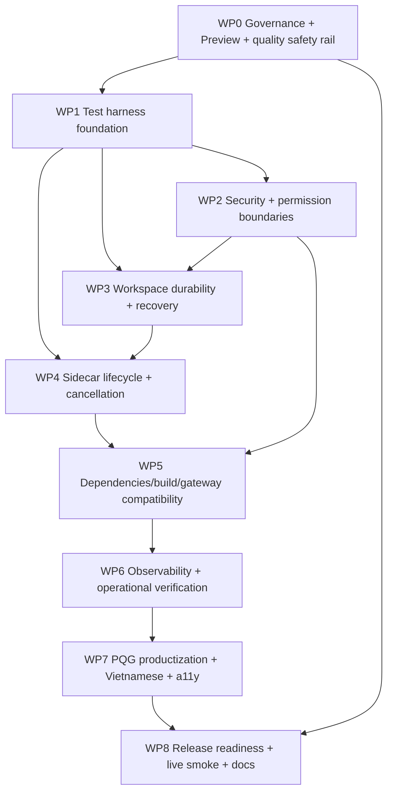

# PHASE 1B — COORDINATOR CONSOLIDATION & MASTER RISK REGISTER

## 1. Metadata

- Repository: `thanhhaixn92/PQG-Harness`
- Canonical base branch: `main`
- Exact base SHA re-verified immediately before Phase 1B: `70119cfdae992a203a5e29eb24e91c7200222a7c`
- Base tree: `489ec3e0c02a95acd99b554de9e6769c0523afd6`
- Coordinator branch: `audit/phase-1b-coordinator-consolidation`
- Phase: **Phase 1B — normalization / deduplication / coordination only**
- Runtime/source changes: **NONE**
- Implementation changes: **NONE**
- Coordinator verdict: **COMPLETE — READY FOR PHASE 2 PLANNING; NOT READY FOR IMPLEMENTATION OR STABLE/PUBLIC RELEASE**

This report consolidates the twelve independent Phase 1 audits. It does not implement any recommendation.

---

## 2. Input audits and integrity check

The coordinator verified all twelve audit branches against the same canonical base SHA. Every audit branch is exactly one commit ahead of `main`, zero commits behind, and changes only one Markdown report file.

| Audit | Report | Raw verdict | P0 | P1 | P2 | P3 |
|---|---|---|---:|---:|---:|---:|
| A01 | `A01-baseline-upstream-governance.md` | PARTIAL | 0 | 1 | 2 | 0 |
| A02 | `A02-runtime-architecture.md` | PARTIAL | 0 | 4 | 4 | 0 |
| A03 | `A03-security-auth-trust.md` | PARTIAL | 0 | 4 | 5 | 2 |
| A04 | `A04-workspace-persistence.md` | FAIL* | 0 | 5 | 3 | 1 |
| A05 | `A05-ai-gateway-models.md` | PASS WITH RISKS | 0 | 2 | 3 | 2 |
| A06 | `A06-mcp-tools-permissions.md` | PASS WITH RISKS | 0 | 4 | 4 | 1 |
| A07 | `A07-build-edgeone-deploy.md` | PARTIAL | 0 | 1 | 6 | 0 |
| A08 | `A08-dependencies-supply-chain.md` | PASS WITH RISKS | 0 | 1 | 3 | 2 |
| A09 | `A09-tests-quality-observability.md` | PARTIAL | 0 | 2 | 3 | 1 |
| A10 | `A10-frontend-productization.md` | PASS WITH RISKS | 0 | 1 | 4 | 1 |
| A11 | `A11-docs-license-operations.md` | PASS WITH RISKS | 0 | 2 | 5 | 1 |
| A12 | `A12-live-production-smoke.md` | PARTIAL | 0 | 0 | 0 | 0 |
| **Raw total** | | | **0** | **27** | **42** | **11** |

Raw total: **80 findings**. These are not 80 independent defects; many intentionally overlap across audit domains.

### 2.1 Schema exception

A04 used verdict `FAIL`, while the Phase 1 prompt schema allowed only `PASS | PASS WITH RISKS | PARTIAL | BLOCKED`. This is a report-schema deviation, not a reason to reject A04 evidence. Coordinator interpretation: **A04 content accepted; normalized status = PASS WITH RISKS / high remediation priority**. The original A04 report is not rewritten in Phase 1B.

### 2.2 A12 evidence limitation

A12 correctly did not fabricate a PASS. Its production runtime checks were blocked because the audit runner could not resolve the EdgeOne hostname. Consequently A12's zero-finding count means **no live defect was confirmed**, not that production passed smoke tests. Live production evidence remains a release verification gap.

---

## 3. Normalization principles

The master register applies these rules:

1. Findings that describe the same root cause are merged.
2. `CONFIRMED` source facts are not upgraded to proven production exploitability when platform behavior is `NOT VERIFIED`.
3. Severity is normalized to the current project objective: a personal/MVP harness first, with separate gates for stable/public use.
4. An upstream preview-status disclaimer is treated as a release constraint/control requirement, not automatically as a code defect.
5. Intentional product behavior such as Full Access is not classified as a vulnerability solely because it is powerful; the issue is the boundary, UX, expiry and fail-safe behavior.
6. Verification gaps are separated from implementation defects.
7. Existing good controls are preserved unless a concrete finding requires change.

### Normalized severity

- **P0:** immediate critical risk. None confirmed.
- **P1:** must be fixed or conclusively verified before the relevant release/use gate.
- **P2:** should be addressed in MVP hardening or controlled as an explicit constraint.
- **P3:** low-priority hygiene. Raw P3 items are absorbed into broader P2 workstreams rather than creating standalone work packages.

---

# 4. MASTER RISK REGISTER — 22 normalized findings

| ID | Severity | Status | Master finding | Disposition |
|---|---|---|---|---|
| M01 | P1 | CONFIRMED | Workspace durability/recovery is non-atomic, incomplete and vulnerable to silent rollback/lost updates | **MUST FIX before durable daily use** |
| M02 | P1 | CONFIRMED | Permission resolution failure falls open to `workspace-write` | **MUST FIX** |
| M03 | P1 | MIXED | No repository-visible auth/ownership boundary for Agent APIs/conversations/stop | **MUST VERIFY/FIX before public/stable use** |
| M04 | P1 | CONFIRMED | Sensitive workspace/tool data can cross model/store/log boundaries without a dedicated sensitive-data policy | **MUST FIX before sensitive-code use** |
| M05 | P1 | CONFIRMED | Preview data-plane credential is returned in a model-visible query-string URL | **MUST FIX before preview publication is trusted** |
| M06 | P1 | CONFIRMED | Sidecar startup/idle/cleanup lifecycle contains races and resource-leak paths | **MUST FIX** |
| M07 | P2 | MIXED | Sidecar uses inconsistent first-request vs latest-request `context` lifetime semantics | **VERIFY platform contract, then fix if request-scoped** |
| M08 | P1 | MIXED | Stop/cancellation is non-atomic and does not prove sandbox commands stop | **MUST FIX** |
| M09 | P1 | CONFIRMED | Production-linked `main` has no repository guardrail or independent quality gate | **MUST FIX before functional change program** |
| M10 | P1 | CONFIRMED / BLOCKED live | Runtime-critical paths have no real integration/E2E proof; production smoke remains blocked | **MUST ADD/VERIFY before stable release** |
| M11 | P2 | CONFIRMED version / reachability NV | Locked `ws@8.21.0` is below subsequent upstream memory-exhaustion hardening | **PATCH EARLY, targeted only** |
| M12 | P2 | CONFIRMED constraint | DSH is developer-preview and the adapter is tightly coupled to a coordinated pre-release/compiled-patch wave | **KEEP PINNED; CONTROL upgrades; do not upgrade in isolation** |
| M13 | P1 | NOT VERIFIED operational state | Production/Preview topology, Auto Deploy, env scope, access gate and deployed-SHA parity are not independently verified | **MUST VERIFY before public/stable release** |
| M14 | P2 | MIXED | AI Gateway privacy/header contract and error/header exposure are insufficiently governed | **MUST VERIFY before sensitive/public use; then minimize** |
| M15 | P2 | CONFIRMED / partially NV | Model/provider catalog, capability metadata and role compatibility are hard-coded beyond available evidence | **SHOULD FIX/CONFIGURE before production BYOK expansion** |
| M16 | P2 | MIXED | Secondary workspace semantics are unclear: symlinks/root authority, dual physical roots, stale preview state and incomplete listings | **SHOULD FIX after M01** |
| M17 | P2 | MIXED | MCP tool-policy metadata is duplicated/drift-prone; Full Access and mapping semantics need stronger invariants | **SHOULD FIX** |
| M18 | P2 | MIXED | Build/native reproducibility has avoidable uncertainty: floating Node major, exceptional native restore integrity, two-install operational cost | **SHOULD FIX cautiously; preserve proven build semantics** |
| M19 | P2 | CONFIRMED | Generated artifacts/tests can self-heal and are over-coupled to source text without a clean-tree behavioral contract | **SHOULD FIX in quality gate** |
| M20 | P2 | NOT VERIFIED | EdgeOne observability exists but trace continuity across spawned DSH/gateway/MCP boundaries is not proven | **VERIFY FIRST; instrument only gaps** |
| M21 | P2 | CONFIRMED / live NV | PQG productization, Vietnamese localization, accessibility and rendered responsive behavior lack an isolated stable layer | **DEFER until hardening baseline is stable** |
| M22 | P2 | CONFIRMED / legal details NV | Operations/governance/provenance/recovery/security docs and third-party release evidence are incomplete | **FOUNDATIONAL docs early; release artifacts later** |

Normalized count: **P0 = 0, P1 = 10, P2 = 12**.

---

# 5. Detailed normalized findings

## M01 — Workspace durability/recovery is not reliable enough to be authoritative

**Sources:** A04-01, A04-02, A04-03, A04-04, A04-05; related A02-P2-03.

Confirmed root causes:

- `workspace_write_file` updates the custom metadata snapshot, while shell-command-created/modified/deleted files are not reconciled into that snapshot.
- Snapshot limits of 80 files / 2 MiB can silently omit or evict content while live writes still succeed.
- Store read errors are collapsed to an empty snapshot; a later successful update can replace prior recovery history.
- Restore is skipped based on generic top-level non-emptiness and is not transactional/retry-safe.
- Concurrent snapshot read-modify-write operations can lose updates.
- DSH settings persistence also has silent failure paths, although it is a separate metadata mechanism.

**Coordinator decision:** P1. This is the highest-priority correctness defect because a coding agent must not report successful work that can later silently roll back after sandbox recreation.

**Planning requirement:** establish one authoritative checkpoint/recovery model, explicit durability status, atomic/retryable restore and concurrency-safe persistence. Prefer platform-native sandbox persistence if its semantics satisfy the use case; prove behavior before replacing the existing fallback.

---

## M02 — Permission failure is fail-open for file mutation

**Source:** A06-P1-01.

If permission-mode resolution is missing/invalid, the custom gate falls back to `workspace-write`, which auto-allows `workspace_write_file`. A product default for a new session is therefore conflated with a policy-resolution failure.

**Coordinator decision:** P1 CONFIRMED.

**Planning requirement:** unknown/error policy state must fail closed to read-only or ask-on-mutation. Preserve `workspace-write` only as an explicit valid user/session default.

---

## M03 — Authentication, ownership and abuse boundaries are not repository-visible

**Sources:** A03-P1-01, A03-P1-02, A03-P2-04, A06-P1-03.

Confirmed facts:

- Host API forwarding has no application-layer login/authorization check in source.
- Browser conversation ID is a client-generated routing/state key.
- `/stop` accepts a body-supplied target without repository-visible ownership validation.
- App-level user quotas/body/rate controls are absent.

Not verified:

- whether the current EdgeOne project has an outer access policy that fully compensates;
- whether EdgeOne independently binds a caller identity to conversation/abort authority.

**Coordinator decision:** P1 as a **public/stable release gate**, not proof of an active exploit.

**Planning requirement:** first inspect/record EdgeOne access policy. If no sufficient platform identity/authorization exists, implement authenticated principal → conversation ownership and protect all Agent entry points including stop.

---

## M04 — Sensitive workspace contents can cross trust boundaries too easily

**Sources:** A03-P1-03, A03-P2-05, A06-P2-04.

Confirmed:

- list/read tools are auto-approved in read-only/workspace-write modes;
- no sensitive filename policy excludes `.env*`, package-manager credentials, private keys, cloud credentials, etc.;
- snapshot persistence stores arbitrary file content in conversation metadata;
- MCP request logging retains raw request bodies in process memory, potentially including file contents and commands.

**Coordinator decision:** P1 for use with confidential code/secrets.

**Planning requirement:** define a sensitive-file/data policy independent of path traversal protection: deny/ask/redact sensitive patterns, keep runtime secrets outside model-readable workspace, exclude/redact sensitive snapshot content, and remove/bound raw request-body logging.

---

## M05 — Preview credential crosses into model-visible content

**Sources:** A03-P2-01, A06-P1-02.

A06 provides the stronger evidence: `context.sandbox.envdAccessToken` is identified by EdgeOne as a data-plane access token, inserted into the URL query and returned as the MCP `publish_preview` tool result.

**Coordinator severity resolution:** normalize to **P1**, superseding A03's P2, because credential movement across the model/tool boundary is directly confirmed. Exact TTL/scope remains NOT VERIFIED.

**Planning requirement:** keep credentialed URL out of model trajectory/log/export where possible. Return an opaque preview handle/status to the model and deliver credentialed access through an authenticated UI channel or narrowly scoped short-lived preview capability.

---

## M06 — Sidecar lifecycle has startup, idle and cleanup races

**Sources:** A02-P1-01, A02-P1-02, A02-P2-01.

Confirmed:

- free-port allocation releases the listener before DSH child bind (TOCTOU);
- readiness checks identify only a port response, not the intended child identity;
- idle sweep evaluates stale `lastUsedAt` before current-use refresh and does not model active SSE streams;
- demand-driven sweep can also leave truly idle resources alive;
- startup failure/unexpected child exit can leave companion processes/listeners behind.

**Coordinator decision:** P1.

**Planning requirement:** one resource owner, idempotent cleanup, safe port ownership/identity handshake, active-use reference/lease model, and deterministic fault-injection tests.

---

## M07 — Long-lived adapters use inconsistent `context` lifetime semantics

**Source:** A02-P1-03; cross-linked to A03/A04/A06.

The sidecar object is updated with the latest request context, while Gateway/MCP closures retain the creation context.

**Coordinator severity resolution:** downgrade raw P1 to **P2 pending platform contract**. The code inconsistency is confirmed, but security/isolation impact depends on whether EdgeOne context members are invocation-scoped or stable conversation/service handles.

**Planning requirement:** obtain authoritative platform semantics or test them. Then adopt one explicit context-lifetime contract rather than mixing first-request and latest-request handles.

---

## M08 — Cancellation/stop does not form one failure-independent state transition

**Sources:** A02-P1-04, A02-P2-02, A06-P1-04, A06-P3-01.

Confirmed/inferred concerns:

- sidecar registry entry is removed before shutdown completes, permitting a replacement start during stop;
- platform `abortActiveRun` is invoked only after sidecar shutdown succeeds/completes;
- SSE cancellation can race sidecar acquisition;
- MCP cancellation is not explicitly propagated into sandbox command execution;
- equal 300-second inner/outer timeout layers provide little headroom.

**Coordinator decision:** P1.

**Planning requirement:** per-conversation stopping/tombstone state, all-settled/finally-style cancellation phases, explicit sandbox command cancellation/process ownership where supported, ordered timeout budgets, and stop-during-start / stop-during-command tests.

---

## M09 — `main` lacks change-control guardrails while serving as the production candidate

**Sources:** A01-P1-01, A09-F01.

Confirmed:

- `main` is `protected:false`;
- rulesets are empty;
- no required statuses/checks exist;
- no GitHub quality workflow currently runs;
- EdgeOne Git deployment is the intended deployment owner.

**Coordinator decision:** P1.

**Planning requirement:** establish `feature/* -> Preview -> PR -> main -> Production`; add one non-deploying quality check and require it after proving it stable. Do not add a second autonomous deploy pipeline.

---

## M10 — Critical runtime behavior is not behaviorally proven

**Sources:** A09-F02, A09-F03, A09-F06; A12 entire live matrix.

Current suite: 34 cases, with 19/34 source/config-contract, 8 unit behavior, 7 mock integration, 0 real integration, 0 E2E. A12 could not reach the production hostname from its runner.

High-value unproven boundaries include gateway streaming, WS→SSE, sidecar boot/readiness, MCP transport, stop/cancel, binary export, preview, real persistence/recovery and browser-rendered behavior.

**Coordinator decision:** P1 because substantive hardening changes should not proceed without a way to detect boundary regressions.

**Planning requirement:** small deterministic adapter integration suite plus a re-runnable non-destructive production smoke matrix; do not maximize test count for its own sake.

---

## M11 — `ws@8.21.0` should receive a targeted patch update

**Source:** A08-P1-01.

Confirmed: lock resolves `ws@8.21.0`; upstream subsequently hardened incomplete-fragment memory handling in `8.21.1+`; `8.21.3` was observed during audit. Actual hostile network reachability in this topology was not proven.

**Coordinator severity resolution:** downgrade raw P1 to **P2** because exploitability/reachability is NOT VERIFIED, while keeping this as an early low-blast-radius patch candidate.

**Planning requirement:** update only within compatible 8.21.x after adding/running event/sidecar smokes. Do not use blanket `npm audit fix`.

---

## M12 — DSH/upstream compatibility is a controlled constraint, not a freshness task

**Sources:** A03-P1-04, A02-P2-04, A07-F04, A08-P2-01, A08-P2-02, A10-F01.

Confirmed:

- DeepSeek Harness upstream labels itself Developer Preview / not security-audited;
- local adapter is content-synchronized with TencentEdgeOne baseline but DSH core has advanced;
- direct DSH dependencies mix exact/caret intent while the lock currently freezes a coherent `0.1.0-rc.6` wave;
- frontend/runtime adaptation patches compiled implementation strings and hard-coded Host API route lists;
- private DOM/class structure is also used by product chrome.

**Coordinator severity resolution:** P2 release constraint. Do not “fix” by blindly upgrading.

**Disposition:** **KEEP current DSH wave pinned until a dedicated coordinated upgrade workstream exists.** Every DSH upgrade must be atomic across the family, patch-contract reviewed, built, integration-tested, preview-deployed and smoke-tested.

---

## M13 — Current production topology and parity need authoritative verification

**Sources:** A07-F01, A07-F05, A07-F06, A12.

Not independently verified:

- Production associated branch;
- Preview association/behavior;
- Auto Deploy state;
- environment-variable presence/scope;
- access/auth gate;
- deployment SHA parity;
- current build logs/timing;
- externally reachable URL health from an independent runner;
- custom-domain/certificate state.

**Coordinator decision:** P1 verification gate. This is not evidence the deployment is broken; it is evidence the release topology has not been independently established.

**Planning requirement:** collect Console evidence without exposing secret values, verify one Preview promotion path, rerun A12 from a network/browser that can reach the site, and record deployed revision/build identity.

---

## M14 — AI Gateway privacy and public error/header policy are insufficiently explicit

**Sources:** A03-P2-02, A03-P3-01, A05-P1-02, A05-P3-01, A05-P3-02, relevant part of A03-P2-04.

Confirmed emission:

- `x-prompt-log: true`;
- `x-gateway-quota-bypass: true`;
- conversation identifier forwarded to gateway;
- broad upstream response header forwarding and raw exception messages.

Not verified:

- authoritative semantics/retention of the two custom gateway headers.

**Coordinator severity resolution:** P2 because privacy semantics are unknown rather than proven harmful; however this is a **must-verify gate before confidential/public use**.

**Planning requirement:** obtain authoritative EdgeOne contract, disable/minimize optional prompt logging if applicable, scope Makers-specific headers to Makers endpoints, define response-header allowlists/public error codes, and keep detailed diagnostics in protected/redacted logs.

---

## M15 — Model/provider metadata and compatibility are overly global

**Sources:** A05-P1-01, A05-P2-01, A05-P2-02, A05-P2-03.

Confirmed:

- built-in Makers model is source fallback;
- all Makers catalog models receive the same 1M context / 256k output metadata without per-model evidence;
- `developer` messages are globally rewritten to `system` regardless of provider/model compatibility;
- model catalog is hard-coded (currently synchronized at audit date).

**Coordinator severity resolution:** P2 for the current personal/MVP context. The built-in default becomes a production release gate, not an immediate defect.

**Planning requirement:** distinguish development vs stable-production model policy; use authoritative per-model capability/compat metadata; move role compatibility to provider/model configuration; maintain or discover catalog deterministically.

---

## M16 — Workspace has additional filesystem/lifecycle semantic gaps after core durability

**Sources:** A04-06, A04-07, A04-08, A04-09.

Includes:

- lexical path containment does not establish symlink/canonical-root behavior;
- shell commands have whole-sandbox semantics despite a workspace `cwd`;
- DSH Host local `/tmp/.../workspace` and Makers sandbox `projects/.../workspace` are distinct physical layers;
- durable preview metadata can outlive the ephemeral preview process/URL;
- listing/truncation/symlink/binary metadata can be incomplete or misleading.

**Coordinator decision:** P2. Fix M01 first; then define the canonical project filesystem and preview lifecycle contracts.

---

## M17 — MCP policy metadata should have one canonical source and stronger invariants

**Sources:** A03-P2-03, A06-P2-01, A06-P2-02, A06-P2-03.

Confirmed/inferred:

- tool registry and permission registry are duplicated;
- `makersRequiredMode()` is incomplete as a general classification function;
- prefix-based public-name mapping is part of the gate and can drift under upstream changes;
- Full Access intentionally removes per-call approval and should remain explicit/high-friction rather than being mistaken for a default safety mode.

**Coordinator decision:** P2.

**Planning requirement:** one typed canonical tool registry with minimum permission mode/handler/metadata, startup/test invariant against actual exposed names, fail-closed mapping behavior, explicit Full Access elevation/expiry UX.

---

## M18 — Build/native reproducibility should be tightened without dismantling a working pipeline

**Sources:** A07-F02, A07-F03, A08-P2-03.

Confirmed/inferred:

- `nodeVersion: "24"` is a floating major while EdgeOne documents exact pre-installed versions;
- build performs a second Linux/x64 `npm ci`, which is purposeful but increases registry/time exposure;
- exceptional `npm pack` native restoration uses exact lockfile version but does not explicitly verify lockfile integrity before extraction.

**Coordinator decision:** P2.

**Planning requirement:** capture the actual successful EdgeOne Node/runtime/build timings first; pin an exact tested Node only after native compatibility proof; preserve the second install until equivalence is demonstrated; verify restored tarball integrity against the lock or use a lock-enforcing mechanism.

---

## M19 — Generated artifacts need an explicit producer/clean-tree contract

**Sources:** A09-F03, A09-F04, A10-F06; related M12 patch coupling.

Confirmed:

- tests/build invoke preparation that rewrites generated content;
- stale committed generated output can be self-healed before assertions unless CI checks the diff;
- source-shape tests dominate runtime-significant UI coverage;
- root `index.html` is generated but that ownership is less obvious than `public/`.

**Coordinator decision:** P2.

**Planning requirement:** preparation once, immediate generated-drift check, then raw typecheck/test/build of the prepared tree; clearly mark authoritative product source vs generated outputs; retain only high-value source-contract tests and add rendered/behavioral tests where needed.

---

## M20 — Verify EdgeOne-native observability before adding another telemetry stack

**Source:** A09-F05.

EdgeOne provides logs/metrics/traces, but the audit did not prove trace continuity across the spawned DSH child, local AI gateway and MCP bridge. DSH telemetry is explicitly disabled in the child.

**Coordinator decision:** P2 / VERIFY FIRST.

**Planning requirement:** run one deterministic Preview scenario with model + MCP + cancellation/error and inspect EdgeOne traces/logs. Add minimal first-party spans/metrics only where native correlation is missing. Do not introduce Sentry/Grafana/Datadog solely because trace continuity is unverified.

---

## M21 — Productization/localization/a11y belongs after runtime hardening

**Sources:** A10-F02, A10-F03, A10-F04, A10-F05; product-facing part of A11-P2-01; browser-header defense-in-depth from A03-P3-02.

Confirmed:

- current product identity remains DeepSeek/EdgeOne-oriented;
- Vietnamese is not a shipped locale; current source locale policy is zh/en and non-`.edgeone.dev` defaults to Chinese absent persisted preference;
- branding has no product-owned source of truth outside generated output;
- custom modal/locked-control keyboard/focus semantics need hardening;
- responsive intent exists but rendered mobile/zoom behavior was not verified;
- a deliberate browser security-header baseline is not committed.

**Coordinator decision:** P2. Defer cosmetic work until M01–M10 hardening provides a stable base; accessibility/security-header items can be included when frontend work begins.

---

## M22 — Governance, provenance, recovery and release evidence need a project-owned layer

**Sources:** A01-P2-01, A01-P2-02, A07-F07, A08-P3-01, A08-P3-02, A11-P1-01, A11-P1-02, A11-P2-01, A11-P2-02, A11-P2-03, A11-P2-04, A11-P2-05, A11-P3-01.

Confirmed gaps include:

- local repository is an unrelated root snapshot despite exact current upstream tree identity;
- package/README metadata still points to upstream product identity;
- no persistent upstream-baseline/sync policy control;
- no project status/deployed-revision record;
- no rollback/incident runbook;
- no project security/secret response policy;
- no architecture/contribution/ownership/known-limits documentation;
- dependency update governance is not explicit;
- third-party SBOM/notice evidence is absent;
- local contributor verification flow is incomplete;
- EdgeOne retains only a limited recent successful deployment artifact window, so older rollback depends on reproducible redeploy/rebuild.

**Coordinator decision:** P2 overall. Some documentation is foundational and should precede broad source modification; SBOM/legal-release artifacts may wait until public/stable packaging.

**Early documents:** `UPSTREAM.md`, `PROJECT_STATUS.md`, `SECURITY.md`, `ARCHITECTURE.md`, `CONTRIBUTING.md`, `RUNBOOK.md`.

**Later release controls:** `CHANGELOG.md`, release policy, SBOM/third-party notice inventory after exact obligations are verified.

---

# 6. Severity/conflict normalization decisions

| Conflict / difference | Coordinator resolution |
|---|---|
| A04 verdict `FAIL` vs allowed schema | Preserve report; normalize audit result to high-risk completed audit, not a schema-valid FAIL verdict |
| Preview token: A03=P2 vs A06=P1 | **P1** because A06 established `envdAccessToken` is a data-plane credential and model-visible exposure is confirmed |
| `ws@8.21.0`: A08=P1 but topology reachability NV | **P2 early patch**; vulnerable/hardening version signal confirmed, exploitability not proven |
| DSH Developer Preview: A03=P1 | **P2 release constraint**; do not treat “upgrade now” as remediation |
| Built-in Makers fallback: A05=P1 | **P2 for personal MVP**, stable-production gate later |
| Context-lifetime split: A02=P1 | **P2 pending EdgeOne context-lifetime contract**; code inconsistency confirmed, blast radius conditional |
| Full Access removes approval: A03=P2 | Retain as **P2 policy/UX constraint**, not a vulnerability by itself; default must remain lower privilege |
| A12 has 0 findings | Treat as **blocked verification**, not PASS; feeds M10/M13 |

---

# 7. Raw-to-master mapping — no Phase 1 finding dropped

| Raw finding(s) | Master |
|---|---|
| A01-P1-01 | M09 |
| A01-P2-01, A01-P2-02 | M22 |
| A02-P1-01, A02-P1-02, A02-P2-01 | M06 |
| A02-P1-03 | M07 |
| A02-P1-04, A02-P2-02 | M08 |
| A02-P2-03 | M01 |
| A02-P2-04 | M12 |
| A03-P1-01, A03-P1-02, A03-P2-04 | M03; gateway-header aspect cross-ref M14 |
| A03-P1-03, A03-P2-05 | M04 |
| A03-P1-04 | M12 |
| A03-P2-01 | M05 |
| A03-P2-02 | M14 |
| A03-P2-03 | M17 |
| A03-P3-01 | M14 |
| A03-P3-02 | M21 |
| A04-01, A04-02, A04-03, A04-04, A04-05 | M01 |
| A04-06, A04-07, A04-08, A04-09 | M16 |
| A05-P1-01, A05-P2-01, A05-P2-02, A05-P2-03 | M15 |
| A05-P1-02, A05-P3-01, A05-P3-02 | M14 |
| A06-P1-01 | M02 |
| A06-P1-02 | M05 |
| A06-P1-03 | M03 |
| A06-P1-04, A06-P3-01 | M08 |
| A06-P2-01, A06-P2-02, A06-P2-03 | M17 |
| A06-P2-04 | M04 |
| A07-F01, A07-F05, A07-F06 | M13 |
| A07-F02, A07-F03 | M18 |
| A07-F04 | M12 |
| A07-F07 | M22 |
| A08-P1-01 | M11 |
| A08-P2-01, A08-P2-02 | M12 |
| A08-P2-03 | M18 |
| A08-P3-01 | M22 |
| A08-P3-02 | M22 |
| A09-F01 | M09 |
| A09-F02 | M10 |
| A09-F03, A09-F04 | M19 |
| A09-F05 | M20 |
| A09-F06 | M10 |
| A10-F01 | M12 |
| A10-F02, A10-F03, A10-F04, A10-F05 | M21 |
| A10-F06 | M19 |
| A11-P1-01, A11-P1-02, A11-P2-01, A11-P2-02, A11-P2-03, A11-P2-04, A11-P2-05, A11-P3-01 | M22 |
| A12 live matrix | M10 + M13 verification gap |

---

# 8. Controls already good and explicitly preserved

Phase 2 planning should avoid regressing these controls:

1. Internal DSH Host, Gateway proxy and MCP bridge bind to loopback.
2. Actual AI Gateway key remains server-side; DSH child receives local/dummy credentials for the Makers adapter path.
3. Default permission mode is not Full Access; read/write/command distinctions exist.
4. Unknown currently-prefixed Makers tools tend toward `ask`, not auto-allow.
5. Direct file helper rejects absolute paths, NUL, empty/`.`/`..` components and normalizes backslashes.
6. Sidecar startup is promise-deduplicated within a process.
7. Readiness, command and process shutdown have bounded timeouts rather than unbounded waits.
8. Patch scripts fail loudly when expected upstream source text disappears.
9. `package-lock.json` plus `npm ci` provide a reproducible dependency baseline.
10. Makers runtime install uses `--ignore-scripts`; native package presence is asserted.
11. `public/` is treated as generated; direct generated editing should remain prohibited.
12. EdgeOne Git Auto Deploy remains the single intended deployment owner; a future GitHub workflow should validate only unless a deliberate deployment migration is approved.
13. DSH package upgrades must remain coordinated rather than freshness-driven.

---

# 9. Planning dependency graph



This graph is sequencing guidance for Phase 2 planning, not permission to implement.

---

# 10. Proposed Phase 2 planning work packages

## WP0 — Baseline governance and change safety

Covers M09 + foundational part of M22.

Plan for:

- `UPSTREAM.md` exact baseline/sync policy;
- `PROJECT_STATUS.md` canonical production URL/revision/readiness;
- development branch/Preview promotion model;
- non-deploying GitHub quality gate design;
- branch protection/ruleset only after quality job is proven stable;
- avoid merging twelve audit PRs individually if each `main` change triggers production Auto Deploy.

## WP1 — Deterministic test harness foundation

Covers M10 + M19.

Plan minimal behavioral fixtures for gateway stream, WS→SSE, sidecar startup/failure, MCP transport/permission, persistence/recovery, stop/cancel, export and preview. Preparation should run once with clean-tree drift detection.

## WP2 — Security and permission boundaries

Covers M02, M03, M04, M05, M14, M17.

Prioritize fail-closed permission resolution and credential/sensitive-data boundaries. Verify EdgeOne access policy before designing redundant authentication.

## WP3 — Workspace durability and recovery

Covers M01 + M16.

Define authoritative filesystem, checkpoint generation, mutation tracking, atomic restore, concurrency semantics, sandbox recycle behavior and preview lifecycle. Do not patch symptoms independently without a coherent durability model.

## WP4 — Sidecar lifecycle and cancellation

Covers M06, M07, M08.

One resource owner, safe startup identity, active-use tracking, context-lifetime contract, all-settled stop state, command cancellation and fault-injection tests.

## WP5 — Dependencies, build and model/gateway compatibility

Covers M11, M12, M15, M18.

Order:

1. targeted `ws` patch after tests;
2. capture successful EdgeOne Node/build baseline;
3. native integrity improvement;
4. provider/model metadata correctness;
5. DSH wave upgrade only as a separate later project.

## WP6 — Observability and operational verification

Covers M13, M20 and operational parts of M22.

Verify Preview/Production mapping, environment scope, access gate, deployment SHA, EdgeOne native traces/logs, rollback behavior and build timings. Rerun A12 from a reachable browser/network.

## WP7 — PQG productization

Covers M21.

Only after runtime/security/durability baseline is stable:

- product-owned branding config outside generated `public/`;
- Vietnamese locale architecture;
- accessible dialog/locked-control behavior;
- responsive/browser smoke;
- custom domain when stable.

## WP8 — Release readiness

Covers remaining M22 and closure evidence for all P1 items.

Create/finish `SECURITY.md`, `ARCHITECTURE.md`, `CONTRIBUTING.md`, `RUNBOOK.md`, changelog/release semantics, dependency/SBOM/license evidence as appropriate, and final live smoke/recovery drill.

---

# 11. Release/use gates

## Gate A — Safe to begin implementation

Required before broad functional editing:

- Phase 2 implementation plan approved by owner;
- work occurs on Preview/feature branches, not directly on `main`;
- baseline/upstream provenance recorded;
- minimal quality-check strategy defined;
- no bulk dependency/DSH upgrade bundled with unrelated fixes.

## Gate B — Durable personal MVP

At minimum close/accept with evidence:

- M01, M02, M04, M05, M06, M08;
- core behavioral tests for those changes;
- successful Preview deployment/smoke;
- sensitive secret handling understood.

## Gate C — Stable/public use

Additionally close/verify:

- M03 authentication/ownership;
- M09 required change-control/quality gate;
- M10 runtime integration + live smoke;
- M13 Production/Preview/access/deployed-SHA evidence;
- M14 gateway privacy contract;
- production-supported model policy under M15;
- rollback/runbook/security documentation under M22.

---

# 12. Explicit deferrals / keep-as-is decisions

Until Phase 2 planning says otherwise:

- **Do not rewrite the architecture.**
- **Do not replace EdgeOne hosting.**
- **Do not add a second deployment pipeline.**
- **Do not upgrade the DSH family piecemeal.**
- **Do not jump to Vite 8 / TypeScript 7 / OTel 2.x for freshness alone.**
- **Do not remove fail-fast compiled-patch guards without an equivalent supported extension path.**
- **Do not make Full Access the default.**
- **Do not hand-edit generated `public/` assets/root generated shell.**
- **Do not start cosmetic PQG rebranding before durability/security/lifecycle hardening unless it is isolated and zero-risk.**
- **Do not interpret A12 as a production PASS.**

---

# 13. Phase 1B conclusion

Phase 1 independent audit coverage is materially sufficient for planning. The 80 raw findings reduce to **22 master findings** with **10 P1** and **12 P2** workstreams/risks after evidence-based deduplication and contextual severity normalization.

The project has **no confirmed P0** finding. The architecture remains a strong MVP baseline and should be hardened rather than rewritten.

The most important implementation sequence is:

```text
change safety / tests
    -> permission + sensitive-data boundaries
    -> workspace durability
    -> sidecar/cancellation lifecycle
    -> targeted dependency/build/gateway hardening
    -> production/observability verification
    -> PQG productization
    -> stable-release controls
```

**Phase 1B status: COMPLETE.**

**Next phase: Phase 2 — write a detailed implementation plan with atomic work packages, exact target files/symbols, tests, acceptance criteria, dependency ordering, rollback points and Preview verification. No code change should begin until that plan is reviewed/approved.**
