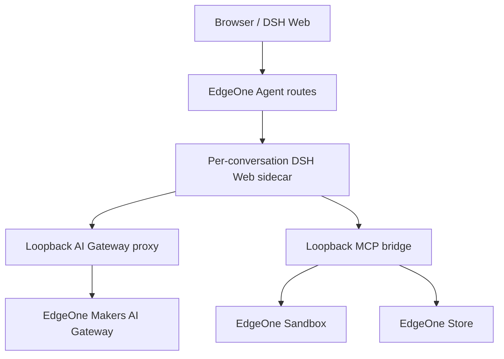

# PQG-Harness WP7 Release Readiness, Runbook & Governance Implementation Plan

> **For agentic workers:** REQUIRED SUB-SKILL: Use superpowers:subagent-driven-development (recommended) or superpowers:executing-plans to implement this plan task-by-task. Steps use checkbox (`- [ ]`) syntax for tracking.

**Goal:** Turn the hardened MVP into an auditable release candidate with explicit security support, architecture/provenance docs, rollback/incident procedures, dependency/license evidence, and a final evidence-backed stable/public release gate.

**Architecture:** Repository documentation becomes the operational source of truth while live EdgeOne facts remain linked to exact deployment/build evidence. Release readiness is a checklist over proven controls, not a version-number claim. No release is tagged until P1 master findings are closed or explicitly accepted by the owner with evidence.

**Tech Stack:** GitHub, EdgeOne Makers, Markdown, npm lock/SBOM tooling, existing quality/smoke workflows.

**Spec:** `docs/audit/phase-1/PHASE-1B-coordinator-consolidation.md` — remaining M22 and closure evidence for M01–M21.

## Global Constraints

- Do not label the app “secure” or “production-ready” merely because tests pass; DeepSeek Harness upstream remains a preview dependency unless its status changes and is re-audited.
- Do not place credentials, cookies, API keys or tokenized preview URLs in docs, screenshots or release artifacts.
- Release docs must distinguish `CONFIRMED`, `ACCEPTED RISK`, and `NOT VERIFIED`.
- EdgeOne remains the sole deployment owner.
- SBOM/license inventory is evidence; it is not legal advice or an automatic conclusion of compliance.

---

## File map

**Create:**
- `SECURITY.md`
- `ARCHITECTURE.md`
- `RUNBOOK.md`
- `CHANGELOG.md`
- `docs/release/RELEASE_CHECKLIST.md`
- `docs/release/KNOWN_LIMITATIONS.md`
- `scripts/third-party-inventory.mjs`
- `tests/third-party-inventory.test.ts`

**Modify:**
- `PROJECT_STATUS.md`
- `README.md` — links to governance/operations docs.
- GitHub repository settings: Private Vulnerability Reporting if available; branch ruleset already planned under WP0.

**Generated release evidence (do not necessarily commit if large):**
- CycloneDX/SPDX SBOM from exact release lock/install.
- third-party license inventory JSON/Markdown.
- final smoke/rollback evidence linked to exact build SHA.

---

### Task 1: Create security support and disclosure policy

**Files:**
- Create: `SECURITY.md`
- Modify: `README.md`

- [ ] **Step 1: Enable a private vulnerability-reporting channel before publishing the policy**

Preferred: GitHub **Private Vulnerability Reporting / Security Advisories** for `thanhhaixn92/PQG-Harness`.

If repository/account settings do not support it, stable/public release remains blocked until the owner supplies an alternative non-public security contact. Do not tell reporters to post secrets/exploits in a public issue.

- [ ] **Step 2: Create `SECURITY.md` with this structure**

```markdown
# Security Policy

## Project status
PQG Harness is an MVP/derivative built on TencentEdgeOne DeepSeek Harness adapter components and the DeepSeek Harness ecosystem. Upstream DeepSeek Harness may remain Developer Preview and is not treated as a validated security boundary.

## Supported versions
Only the currently identified release in `PROJECT_STATUS.md` receives security fixes unless a release table below states otherwise.

## Reporting a vulnerability
Use GitHub Private Vulnerability Reporting / Security Advisories for this repository. Do not disclose secrets, tokens, private source code, or exploit details in public issues.

## Secret handling
- Never commit `.env`, API keys, cookies or access tokens.
- Runtime secrets belong in EdgeOne managed environment configuration.
- Rotate/revoke a credential immediately if exposure is suspected.
- Preview/data-plane tokens must not be copied into issue bodies, logs or release docs.

## Security boundaries
- EdgeOne access/auth policy protects public Agent endpoints as documented in `PROJECT_STATUS.md`.
- Conversation IDs are routing/state identifiers, not user authentication credentials.
- Full Access authorizes arbitrary shell commands inside the EdgeOne conversation sandbox; it is not the default mode.
- Automatic workspace file tools deny configured sensitive-file patterns.
```

Replace only statements whose underlying WP evidence is actually confirmed. If access/auth is still unresolved, write `NOT VERIFIED / release blocker` rather than claiming protection.

- [ ] **Step 3: Link from README**

Add Security → `SECURITY.md` and Status → `PROJECT_STATUS.md`.

- [ ] **Step 4: Validate no secret-like values were copied**

Run a lightweight repository scan using existing grep/search patterns for known env variable **values are unknown**, so scan only obvious credential formats and accidental `access_token=` URLs. Do not print matched secrets to CI logs; if a suspected secret is found, stop and rotate outside the repository before proceeding.

- [ ] **Step 5: Commit**

```bash
git add SECURITY.md README.md
git commit -m "docs: add PQG Harness security policy"
```

---

### Task 2: Document actual architecture and trust/persistence boundaries

**Files:**
- Create: `ARCHITECTURE.md`
- Modify: `README.md`

- [ ] **Step 1: Write the current post-WP architecture, not the original audit state**

Required sections:

1. Browser/DSH Web shell.
2. EdgeOne Agent static Host API routes.
3. per-conversation DSH sidecar.
4. local AI Gateway adapter.
5. local MCP bridge.
6. EdgeOne sandbox/store/models.
7. workspace canonical root + native checkpoint lifecycle from WP2.
8. sidecar lifecycle/stop state from WP3.
9. permission modes and sensitive-file boundary from WP1.
10. generated-vs-source ownership.
11. deployment responsibility split.

- [ ] **Step 2: Add Mermaid runtime flow**



Update labels if implementation changes the exact ownership, but do not omit trust boundaries.

- [ ] **Step 3: Add persistence flow**

Explicitly distinguish:
- DSH local `/tmp` runtime state;
- EdgeOne sandbox project source;
- native sandbox persisted checkpoint;
- conversation metadata/settings;
- preview process state (ephemeral).

- [ ] **Step 4: Link from README and commit**

```bash
git add ARCHITECTURE.md README.md
git commit -m "docs: document PQG Harness architecture"
```

---

### Task 3: Create operational runbook from rehearsed behavior

**Files:**
- Create: `RUNBOOK.md`

**Interfaces:**
- Uses factual WP5 deployment/rollback evidence; does not invent Console controls.

- [ ] **Step 1: Write deployment section**

Include exact flow:

```text
feature/fix branch
 -> GitHub quality check
 -> EdgeOne Preview Auto Deploy
 -> Preview build-meta + smoke
 -> reviewed PR merge to main
 -> EdgeOne Production Auto Deploy
 -> Production build-meta + safe smoke
```

- [ ] **Step 2: Write incident triage checklist**

Order:

1. identify exact `/build-meta.json` commit/tree;
2. inspect EdgeOne deployment status/build log;
3. inspect Agent logs/traces by non-secret request/session identifier;
4. classify frontend vs Agent proxy vs sidecar vs Gateway/model vs MCP/sandbox vs persistence;
5. stop further promotion/merge if incident is active;
6. choose rollback/redeploy path.

- [ ] **Step 3: Write rollback procedure using WP5 observed semantics**

Include:
- recent retained deployment rollback/redeploy path if confirmed;
- source-SHA rebuild path for older versions;
- verify `/build-meta.json` after recovery;
- smoke after rollback;
- environment-variable changes require a new deployment if that is what WP5 confirmed.

Do not use generic UI steps that were not actually rehearsed.

- [ ] **Step 4: Write credential incident procedure**

For leaked AI Gateway/provider/preview credential:
- revoke/rotate in EdgeOne/provider console;
- redeploy if runtime env needs refresh;
- invalidate affected preview/sandbox if applicable;
- inspect logs without copying secret;
- document incident ID/time, not secret value.

- [ ] **Step 5: Write workspace recovery procedure**

Using WP2 behavior:
- identify same conversation;
- confirm native checkpoint restore result;
- check checkpoint metadata/instance ID if available;
- do not persist an incomplete workspace after restore error;
- Preview process must be restarted after sandbox recreation.

- [ ] **Step 6: Commit**

```bash
git add RUNBOOK.md
git commit -m "docs: add deployment and recovery runbook"
```

---

### Task 4: Add release checklist and known limitations

**Files:**
- Create: `docs/release/RELEASE_CHECKLIST.md`
- Create: `docs/release/KNOWN_LIMITATIONS.md`

- [ ] **Step 1: Create checklist mapped to master findings**

Minimum checklist:

```markdown
# Release Checklist

## Source/change control
- [ ] quality check green for release SHA
- [ ] main ruleset/PR policy active
- [ ] UPSTREAM.md baseline current
- [ ] no unrelated DSH wave change

## Security
- [ ] permission fallback fail-closed
- [ ] sensitive-file policy tests green
- [ ] preview token absent from model/MCP output
- [ ] Agent access/auth policy CONFIRMED
- [ ] Gateway prompt/quota header contract resolved or release explicitly blocked

## Durability/runtime
- [ ] workspace recycle test passes
- [ ] command-created/modified/deleted files restore correctly
- [ ] sidecar lifecycle tests green
- [ ] Stop/cancellation Preview test passes

## Dependencies/build
- [ ] ws hardened patch present
- [ ] native tarball integrity test green
- [ ] exact EdgeOne Node version verified if pinned
- [ ] build-meta commit matches release SHA

## Live validation
- [ ] Preview smoke complete
- [ ] Production safe smoke complete
- [ ] rollback rehearsal current
- [ ] native logs/traces reviewed

## Documentation
- [ ] SECURITY.md current
- [ ] ARCHITECTURE.md current
- [ ] RUNBOOK.md current
- [ ] PROJECT_STATUS.md records release SHA
- [ ] known limitations reviewed
- [ ] SBOM/license inventory generated/reviewed
```

- [ ] **Step 2: Create known-limitations document**

Include only facts still true after implementation, such as:
- upstream DeepSeek Harness Developer Preview status if unchanged;
- Full Access executes arbitrary sandbox shell commands;
- native sandbox checkpoints exclude dependencies/build/cache and have platform size/lifecycle limits;
- full Vietnamese UI may be deferred if no stable locale-extension path exists;
- model/provider constraints not authoritative where docs do not publish them.

Delete limitations that have actually been fixed rather than carrying stale audit statements forward.

- [ ] **Step 3: Commit**

```bash
git add docs/release/RELEASE_CHECKLIST.md docs/release/KNOWN_LIMITATIONS.md
git commit -m "docs: add release gates and known limitations"
```

---

### Task 5: Generate reproducible third-party dependency/license inventory

**Files:**
- Create: `scripts/third-party-inventory.mjs`
- Create: `tests/third-party-inventory.test.ts`

**Interfaces:**

The script reads `package-lock.json` and installed package manifests after `npm ci`, emitting sorted JSON records:

```ts
{
  name: string
  version: string
  license: string | string[] | null
  resolved?: string
  integrity?: string
}
```

It does not assert legal compliance.

- [ ] **Step 1: Write pure sorting/normalization tests**

Test scoped-package name extraction from `node_modules/@scope/name`, unscoped names, missing license → null, deterministic sort by `name@version`.

- [ ] **Step 2: Implement inventory script**

For each `lock.packages` entry beginning `node_modules/`:
- derive package name;
- use lock version;
- read installed `node_modules/<name>/package.json` for `license`/`licenses` where present;
- copy `resolved` and `integrity` from lock;
- do not read arbitrary package files into output.

CLI:

```bash
node scripts/third-party-inventory.mjs > third-party-inventory.json
```

- [ ] **Step 3: Generate CycloneDX SBOM using current npm if supported**

First verify:

```bash
npm sbom --help
```

If supported, generate exact release evidence:

```bash
npm sbom --sbom-format cyclonedx > sbom.cdx.json
```

If current npm does not support this command, do not add a random SBOM dependency in this task; retain the deterministic inventory and create a separately reviewed SBOM-tool decision.

- [ ] **Step 4: Review licenses rather than auto-concluding compliance**

Flag records with missing/unknown/nonstandard license metadata for human/legal review. Preserve upstream `LICENSE` and any package notices included in distributed artifacts.

- [ ] **Step 5: Add release-artifact policy**

`third-party-inventory.json` and SBOM may be attached to a GitHub release rather than committed on every build. Commit only the generator/tests unless the owner chooses a repository-held inventory policy.

- [ ] **Step 6: Run tests and commit**

```bash
node --experimental-strip-types --test tests/third-party-inventory.test.ts
npm ci
node scripts/third-party-inventory.mjs > /tmp/third-party-inventory.json
```

Expected: deterministic valid JSON, no secret values.

```bash
git add scripts/third-party-inventory.mjs tests/third-party-inventory.test.ts
git commit -m "chore: generate third-party dependency inventory"
```

---

### Task 6: Establish changelog and release semantics

**Files:**
- Create: `CHANGELOG.md`
- Modify: `PROJECT_STATUS.md`

- [ ] **Step 1: Create Keep-a-Changelog-style structure without inventing past releases**

```markdown
# Changelog

## [Unreleased]

### Added
### Changed
### Fixed
### Security
```

Do not retroactively claim releases that do not exist.

- [ ] **Step 2: Choose first PQG release only after all Gate C items pass**

Recommended first project-specific tag: `v0.1.0-pqg.1` if the owner wants to preserve distinction from upstream/package `0.1.0`. Do not create the tag during planning or before release checklist approval.

- [ ] **Step 3: Update `PROJECT_STATUS.md` release state**

Before final approval:

```markdown
- Release state: release candidate
```

Only after Gate C:

```markdown
- Release state: stable/public approved by owner on <date>
```

- [ ] **Step 4: Commit**

```bash
git add CHANGELOG.md PROJECT_STATUS.md
git commit -m "docs: establish PQG release history"
```

---

### Task 7: Final release-candidate verification

**Files:**
- No source changes. Verification evidence may be saved under `docs/verification/` with exact SHA and no secrets.

- [ ] **Step 1: Freeze exact RC commit**

Record:

```bash
git rev-parse HEAD
git rev-parse HEAD^{tree}
```

No code/dependency change after this point without restarting relevant verification.

- [ ] **Step 2: Run complete local/CI gate**

```bash
npm ci
npm run prepare:dsh-web
git diff --exit-code -- index.html public agents/api
npm run typecheck
npm run test:prepared
npm run build:prepared
```

Plus all new integration tests from WP1–WP4.

- [ ] **Step 3: Preview deploy and smoke**

Verify `/build-meta.json` equals RC SHA; run full Preview A12-equivalent matrix including recycle/cancellation tests where safe.

- [ ] **Step 4: Review every P1 master finding**

For M01, M02, M03, M04, M05, M06, M08, M09, M10, M13 record one of:
- `CLOSED — <evidence>`;
- `ACCEPTED RISK — owner approval + reason + expiry/review date`.

A P1 may not remain `NOT VERIFIED` for stable/public approval.

- [ ] **Step 5: Review P2 items/known limitations**

Any open P2 must be documented in `KNOWN_LIMITATIONS.md` with impact and mitigation or deferred owner decision.

- [ ] **Step 6: Generate third-party inventory/SBOM evidence**

Tie artifacts to exact RC lock/commit.

- [ ] **Step 7: Owner release approval**

Only after the owner approves the completed checklist may the RC be merged/tagged/released according to the chosen policy.

- [ ] **Step 8: Production deploy verification**

After approved merge:
- `/build-meta.json` == approved release SHA;
- safe Production smoke passes;
- logs/traces show no new critical errors;
- `PROJECT_STATUS.md` updated on the next docs release if necessary.

---

## WP7 acceptance criteria

- [ ] Private vulnerability reporting path exists.
- [ ] SECURITY, ARCHITECTURE, RUNBOOK, RELEASE_CHECKLIST, KNOWN_LIMITATIONS and CHANGELOG exist and reflect the implemented state.
- [ ] Upstream provenance remains explicit.
- [ ] Rollback steps are based on a rehearsed Preview path.
- [ ] Third-party inventory is reproducible; SBOM generated when supported; legal conclusions are not fabricated.
- [ ] Every P1 master finding is CLOSED or owner-accepted with evidence; none remains NOT VERIFIED for stable/public release.
- [ ] Final Preview and Production build metadata prove deployed-SHA parity.
- [ ] Stable/public label/tag occurs only after owner approval.

## Rollback

Documentation changes can be corrected independently, but a released tag should not be rewritten. If a post-release defect appears, follow `RUNBOOK.md`, revert/redeploy a known-good SHA, open a new changelog entry, and publish a new release rather than mutating historical release evidence.